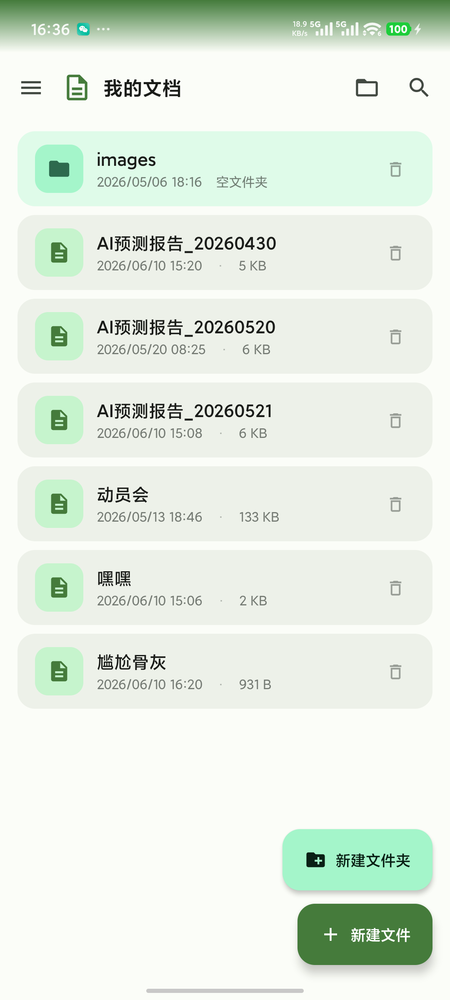
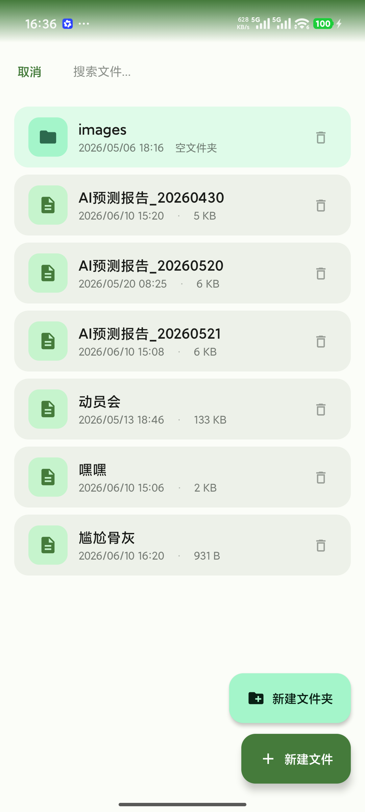
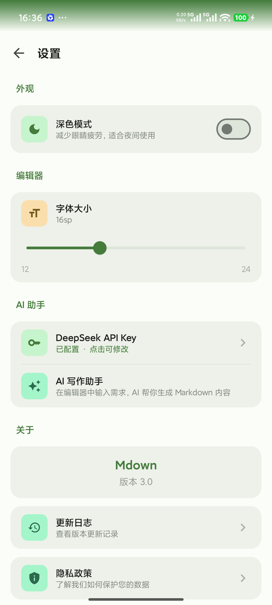
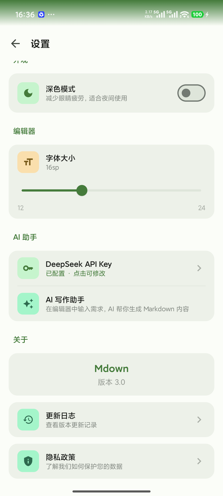

# Mdown — Android Markdown 编辑器

> 安卓端最好用的 Markdown 编辑器：所见即所得 + AI 写作助手 + 五种格式导出

[](https://developer.android.com)
[](https://kotlinlang.org)
[](https://developer.android.com/compose)
[](https://api-docs.deepseek.com)
[](LICENSE)

<p align="center">
  
  
  
</p>

## ✨ 核心特性

### 📝 三种编辑模式

| 模式 | 说明 | 适合 |
|------|------|------|
| **编辑** | 所见即所得（WYSIWYG），像 Word 一样编辑 Markdown | 大多数用户 |
| **源代码** | 纯文本 Markdown 编辑 | 熟悉语法的用户 |
| **分屏** | 左边编辑、右边实时预览 | 学习语法 / 复杂排版 |

### 🤖 AI 写作助手

编辑器底部内嵌 AI 聊天栏，支持三种交互方式：

- 🆕 **新建**：输入「写一篇周报」→ AI 生成内容并插入
- ✏️ **选中修改**：选中段落，输入「润色这段」→ AI 只修改选中部分
- 📝 **全文修改**：输入「把所有二级标题改成三级」→ AI 自动定位并返回完整修改后文档

> 技术方案：DeepSeek-V4-Pro API · 自研修改意图识别（30+ 关键词） · System Prompt 三层设计 · 后台执行不中断

### 📤 五种格式导出

| PDF | PNG 图片 | HTML 网页 | TXT 纯文本 | Markdown 源文件 |
|-----|---------|----------|-----------|---------------|
| 适合打印/分享 | 长截图 | 带样式网页 | 无格式纯文本 | 分享给其他编辑器 |

所有导出文件保存至 `Download/Mdown/` 目录。

### 🎨 更多功能

- **格式化工具栏**：30+ 按钮，一键插入标题/加粗/列表/表格/代码块
- **键盘快捷键**：25+ 组合键（Ctrl+B/I/S/K/L 等），外接键盘高效编辑
- **文件管理**：创建/删除/复制/移动/搜索，支持文件夹分类
- **深色模式**：Material 3 Dark Theme，适配系统主题
- **平板自适应**：自动识别设备，平板默认分屏布局
- **离线可用**：除 AI 功能外全部离线

## 📸 截图

| 首页 | 编辑器 | AI 助手 |
|------|--------|---------|
|  |  |  |

| 导出 | 设置 | AI 配置 |
|------|------|---------|
|  |  |  |

## 🏗️ 技术架构

```
📦 Mdown
├── Kotlin + Jetpack Compose + Material 3
├── MVVM + Repository 架构
├── Hilt 依赖注入
├── WebView contentEditable（WYSIWYG 内核）
├── flexmark（Markdown → HTML 渲染）
├── Jsoup（HTML → Markdown 自研逆转换）
├── OkHttp 4.12（AI API 调用）
├── Room + DataStore（数据持久化）
└── iText + Canvas（多格式导出引擎）
```

**为什么选 WebView 而不是原生 Compose？**
- 渲染一致性：编辑和预览用同一个 HTML 引擎
- 排版能力：表格、代码块、图片混排天然支持
- 扩展性：未来支持数学公式（MathJax）、Mermaid 图表无需重构

[查看完整 PRD →](docs/PRD.md) | [一页版 PRD →](docs/PRD_一页版.md)

## 🚀 快速开始

### 环境要求
- Android Studio Hedgehog (2023.1.1) 或更高版本
- JDK 17
- Android SDK 35
- Gradle 8.10+

### 构建

```bash
git clone https://github.com/1934399340/Mdown.git
cd Mdown
./gradlew assembleDebug
```

APK 输出路径：`app/build/outputs/apk/debug/Mdown-3.0.apk`

### 使用 AI 功能

1. 打开 Mdown → 设置 → AI 助手 → 填入 [DeepSeek API Key](https://platform.deepseek.com/api_keys)
2. 进入任意文档 → 点击底部 AI 输入框 → 输入写作需求 → 发送

## 📋 版本历史

| 版本 | 日期 | 关键变更 |
|------|------|---------|
| **v3.0** | 2026-05 | WYSIWYG 编辑 · AI 写作助手 · HTML↔Markdown 双向转换 |
| v2.x | 2026-03~04 | 文件管理增强 · 深色模式 · 快捷键 · 状态栏优化 |
| v1.0 | 2026-02 | 基础编辑 · 文件保存 · PDF/HTML 导出 |

[完整更新日志 →](docs/CHANGELOG.md)

## 🗺️ 路线图

- [ ] AI 流式输出（SSE）
- [ ] 多模型支持（OpenAI / Anthropic）
- [ ] 文档模板（周报、会议纪要等）
- [ ] Google Drive 云同步
- [ ] Google Play 上架
- [ ] 数学公式渲染（LaTeX）

## 📄 许可证

MIT License

---

> Built with ❤️ and AI · 2026
